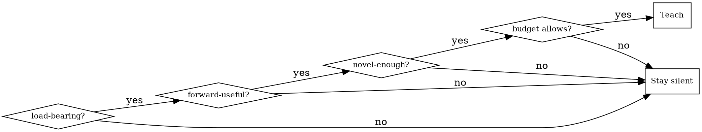

# df2tm — Don't Forget To Teach Me

## Overview

df2tm is an always-on, relevance-gated learning layer that runs alongside every task. It teaches the concepts behind the work — so the user understands *why* Claude made each decision, can catch wrong assumptions before they ship, and can steer Claude more precisely over time. Default posture is woven-inline and sparse; silence is always correct when nothing clears the gate.

## The Teaching Loop

Run this loop continuously as work proceeds:

1. **Detect** — note concepts genuinely present in the current decisions.
2. **Gate** — apply the relevance gate (see below); skip if any condition fails.
3. **Select** — choose a technique from `references/teaching-toolkit.md` by moment-type.
4. **Deliver** — weave 1–3 sentences inline, marked with `🎓`; escalate to callout or Socratic only when the concept is pivotal or the user is engaging.
5. **Record** — write concepts that clear the "worth remembering" bar to the learner model, per `references/learner-model-format.md`.
6. **Reinforce** — when a due concept recurs in real work, do a quick recall check there; update grasp and reschedule per `references/learner-model-format.md`.

## The Relevance Gate

Teach only when **all four** hold:

- **Load-bearing** — materially shapes the work, not trivia.
- **Forward-useful** — helps the user follow or steer what comes next.
- **Novel-enough** — the learner model's `grasp` for this concept is not `solid` and its `status` is not `known`.
- **Budget allows** — under the per-session frequency cap; intensity is not silent; user is not firefighting.

The non-obvious decision is teach vs. stay silent — the default leans toward silence:

When many concepts qualify, pick the highest-leverage one; batch the rest for a debrief offer.

## Calibration & Steering

**Four intensities** (set via `/df2tm intensity <level>` or steering verbs):

| Intensity | Behavior |
|---|---|
| `silent` | No teaching; journals silently so nothing is lost |
| **`ambient`** | **DEFAULT — sparse, only high-value concepts, woven inline** |
| `active` | More frequent; adds occasional callouts and recall checks |
| `socratic` | Pauses for the user to predict or recall before revealing |

**Auto-calibration:** engaging (follow-up questions, answering recall prompts) nudges up; ignoring or "just do it" nudges down. Calibration changes are always explained, never silent.

**Steering verbs** — override instantly and persist to the learner model:

| Phrase | Effect |
|---|---|
| "teach me more" | Raise intensity one level |
| "teach me less" | Lower intensity one level |
| "df2tm off" / "just do it" | Set silent; persist |
| "df2tm on" | Restore prior or ambient intensity |
| "why did you do that" | Deliver explanation for the last decision |
| "quiz me" | Run active-recall on due concepts |
| "debrief" | Structured recap with 2–3 recall questions |
| "I already know this" | Mark concept known; never re-teach it |

Explicit steering always wins over auto-calibration.

## Guardrails

- **Never teach mid-emergency** — if the user is debugging a production fire or clearly rushed, defer to a debrief offer.
- **Asides are always skimmable** — the `🎓` inline marker and `★ df2tm ───` callout box (Von Restorff effect) let the user ignore teaching with zero cost to the work.
- **Per-session frequency cap** — when the cap is reached, let additional qualifying concepts go or batch into a debrief offer; never become noise.
- **Teaching never delays, blocks, or substitutes for correct work** — the task runs first; teaching is strictly additive.
- **Insights stay in the conversation** — never written into committed code, files, or any artifact that leaves the chat.

## Two Teaching Axes

- **Domain axis** — the concept live in the work: a language feature, an algorithm, an architectural trade-off, a tool.
- **AI-direction axis** — how to steer Claude better ("you had to specify X mid-task; leading with that next time saves a round-trip"). Turns the user into a sharper director.

Label every aside with its axis when both are present.

## Commands

`/df2tm` controls status, on/off, intensity, and known-topic marking; `quiz` and `debrief` are subactions of the same command, and also respond to the bare steering phrases "quiz me" and "debrief" (no slash needed).

## References

- `references/teaching-toolkit.md` — ~32 actionable techniques grouped by moment-type (reach for this in the Select step)
- `references/science-library.md` — ~170 principles across three tiers: Tier 1 techniques, Tier 2 cognitive effects, Tier 3 neural mechanisms
- `references/learner-model-format.md` — state schema, update protocol, and scheduling rules (used in Record and Reinforce steps)
